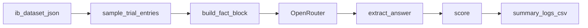

# ib-human-vs-llm-comparison

Empirical **Information Bottleneck** comparison: how does **memory** (direct association) vs **reasoning** (pairing + city) accuracy change as you pack more facts (**N**) into one prompt? This repository provides a synthetic dataset, an **OpenRouter**-backed LLM evaluation pipeline, and exports for plotting.

**Scope:** The automated pipeline evaluates LLMs and can export matched human-study manifests. Human participant responses can be normalized into the same result schema for comparison.

## Requirements

- **Python 3.10+** (uses `list[...]` type syntax and modern `pathlib`).
- An [OpenRouter](https://openrouter.ai/) API key: `export OPENROUTER_API_KEY=...`

## Setup

```bash
conda create -n infotheory python=3.10 -y
conda activate infotheory
pip install -r requirements.txt
```

## How it works



1. Load `data/ib_dataset.json` and sample **N** rows from **N** distinct `group_id`s per trial (shared across all models for fairness).
2. Build one shuffled `Facts:` block (2N lines: pairings + cities).
3. Query each model with memory and reasoning questions (default: two calls per person; optional **combined** or **summarize** modes).
4. Parse the reply with `extract_answer`, then **case-insensitive exact match** against `memory_answer` / `reasoning_answer` (no LLM-as-judge).
5. Write categorized run outputs under `results/model_runs/<smoke|full>/<separate|combined|summarize>/<run_id>/` with `metadata.json`, `summary.json`, compressed `logs.jsonl.gz`, and `results.csv`.

## Run

```bash
export OPENROUTER_API_KEY=sk-or-...
python3 main.py --smoke
python3 main.py
python3 main.py --models gemma-3-4b
python3 main.py --smoke --combined
python3 main.py --smoke --summarize
python3 main.py --smoke --trials 1 --export-human-manifest /tmp/ib_manifest.json --manifest-only
```

## Code layout

| Path | Role |
|------|------|
| `main.py` | Single CLI entrypoint for model runs and human-manifest exports |
| `features/experiment_runner/` | CLI parsing and orchestration |
| `features/trial_generation/` | Dataset generation, trial sampling, prompt construction, model trial runners |
| `features/model_inference/` | Provider adapters such as OpenRouter |
| `features/scoring/` | Answer extraction and exact-match scoring |
| `features/results_io/` | Dataset loading, categorized run paths, compressed result persistence |
| `features/human_study/` | Human trial manifest export and human result normalization |
| `features/analysis/` | Human-vs-model aggregate metrics and confidence intervals |
| `shared/` | Shared runtime config and typed contracts |
| `data/ib_dataset.json` | Synthetic facts and gold answers used by the evaluation pipeline |


## Dataset Notes

- `data/ib_dataset.json` is generated by `features/trial_generation/dataset_generator.py`.
- Each row includes pairing facts, city attributes, memory/reasoning questions, and gold answers.
- The current evaluation pipeline uses the row fields and rebuilds a shuffled `Facts:` block per trial.
- `variants` in the dataset are reserved for future ablation/counterfactual experiments.

## Tests

```bash
conda activate infotheory
pytest tests/ -q
```

## License

See `LICENSE`.
